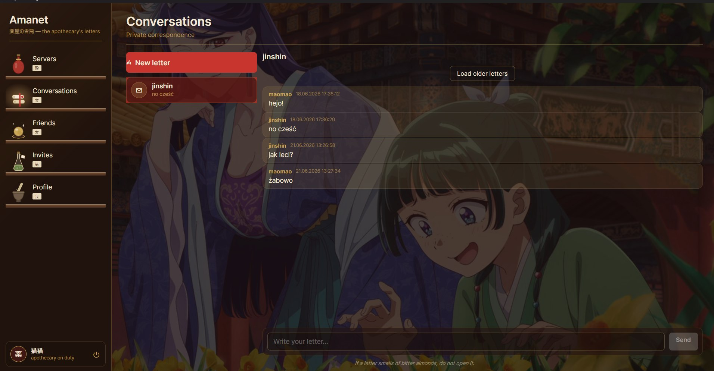

# Amanet

**薬屋の書簡 – the apothecary's letters**

Amanet is a Discord-style real-time chat application. It supports private direct messaging, server/channel messaging, friend management and live message delivery. The whole thing is dressed in an apothecary-and-letters theme: conversations are "letters", servers are "pavilions", friends are "allies", and the UI is built out of parchment, brass and wooden shelves.

## What it is

The project is split into two halves:

- Avalonia UI written in C# with XAML, following MVVM (CommunityToolkit.Mvvm). This is what the user actually sees and clicks.
- ASP.NET Core with PostgreSQL, Redis and SignalR, using EF Core on top. The client talks to it over a versioned REST API (`api/v1/...`).

Both run together via Docker Compose (backend + PostgreSQL + Redis).

> Technical details (database schema, the SignalR/WebSocket layer, file storage, Redis caching, EF Core wiring) live in the separate documentation. This README is just the high-level tour.

## How it works

You log in or register, and the backend hands back a token. The client stores that token for the session and attaches it as a `Bearer` header to every following request, so the API knows who you are.

Once you are in, the app is organised into five sections down the left rail:

- **Servers** – the pavilions you belong to. Create servers, add channels, manage roles and permissions, see participants, and invite people.
- **Conversations** – private correspondence. A list of your one-to-one chats on the left, the selected thread's messages on the right, with a box to write and send your reply.
- **Friends** – search the registry for other users, send requests, accept or reject incoming ones, cancel ones you sent, and remove existing friends.
- **Invites** – server summons sent to you by other people, which you can accept or decline.
- **Profile** – your record in the palace: username, avatar and account settings.

Messages load newest-first from the server and are arranged oldest-to-newest so the conversation reads top to bottom like a normal chat. Older history is fetched on demand with cursor-based pagination (the "Load older letters" button), so a long thread does not all load at once.

## What has been implemented

- **Authentication** – register (with optional avatar upload), login, token/session handling, logout.
- **Direct messages** – list conversations, open a thread, read its history with pagination, and send new messages.
- **Server messaging** – create servers and channels, send channel messages, with roles and permission checks deciding who can do what.
- **Friend management** – user search, send/accept/reject/cancel friend requests, remove friends, friends list.
- **Server invites** – send invites from a server, receive and act on invites addressed to you.
- **Profile** – view and update your profile, including avatar.
- **Theming and UX** – the full apothecary visual language (ParchmentBrush/BrassBrush, card/slip components, the wooden-shelf navigation with hover and selection states).

## What can be added in the future

- **Edit and delete messages** – the DTOs already carry the shape for this (`CreateOrPatchMessageDTO`, `MessageDTO.Edited`), but the feature is not wired up yet.

---

*If a letter smells of bitter almonds, do not open it.*
